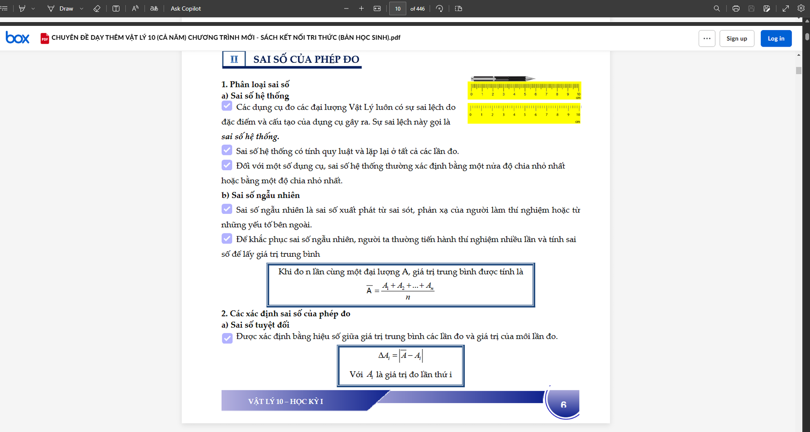

# Web Screenshot to PDF

This project automates capturing screenshots from a webpage by scrolling dynamically and combining them into a PDF file. It supports large documents (e.g., thousands of pages) with error handling and configurable options.

## Features
- Access a specified URL and scroll dynamically based on page height.
- Capture screenshots for a specified number of pages.
- Optional login support for authenticated pages.
- Rename screenshot files to a 3-digit format (e.g., `page_001.png`).
- Combine screenshots into a PDF file.

## Installation

Install required libraries:
   ```bash
   pip install -r requirements.txt
   ```

## Usage
1. Run the main script with command-line arguments:
    ```bash
    python src/main.py --url <URL> --pages <NUMBER> [--email <EMAIL>] [--password <PASSWORD>] [--output <PDF_NAME>]
    ```
- `--url`: URL of the webpage (required).
- `--pages`: Number of pages to capture (required).
- `--email`: Email for login (optional).
- `--password`: Password for login (optional).
- `--output`: Output PDF file name (default: `output_screenshots.pdf`).

2. Run the rename script to standardize filenames:
    ```bash
    python scr/rename_files.py
    ```
## Example 
Capture 446 pages from a Box URL without login:
    ```bash
    python src/main.py --url https://app.box.com/s/7mnv4zzizj3yizwnhuiaa4q7jycn9orr --pages 446
    ```
### Sample Results


# Contributing
Contributions are welcome! Please:
- Open an issue to report bugs or suggest features.
- Submit a pull request with your improvements.


